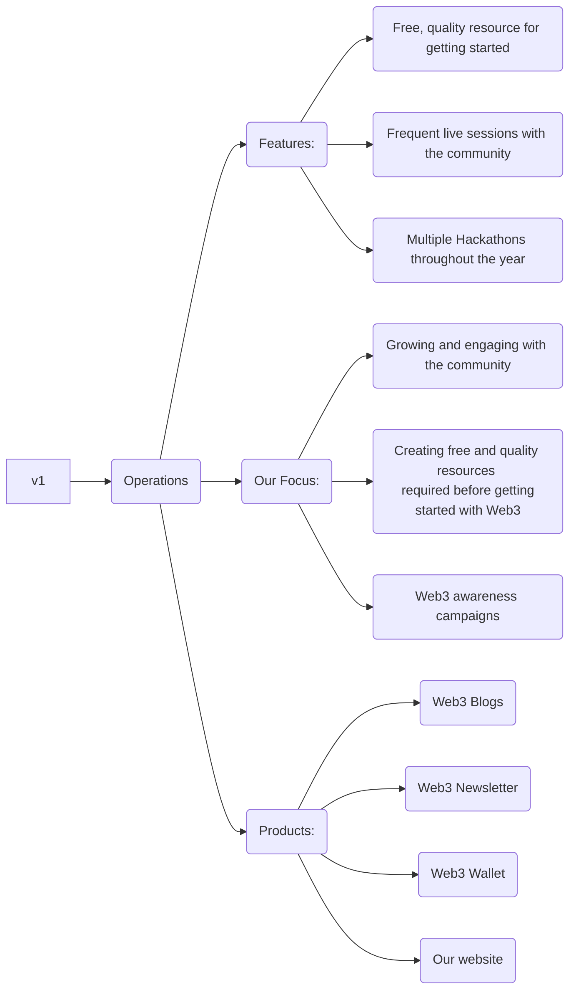

# Web3 Forge(v.1) Whitepaper
**Year**: 2023  
_We maintain this paper because it continues to serve as a useful reference and an accurate representation of Web3 Forge and its vision_

# Foundation:

Web3 Forge is founded by [Fahad Iqbal Zafar](https://www.linkedin.com/in/fahad-iqbal-zafar/), with the vision to become one of the largest open-source **Web3** learning and research platform. Along the way, [Athar Shaik](https://www.linkedin.com/in/athar-shaik-a30a18207/), [Su Myat Aung](https://www.linkedin.com/in/sumyat-aung/), [Fadhil]() and [Shahid Khan](https://www.instagram.com/___shahid07/?igshid=MzNlNGNkZWQ4Mg%3D%3D) joined the **Core Team**.

## Our Mission:

Our mission is to become one of the pioneers in the future of **Web3** and become the leading **Web3** learning, earning and research platform.

## Current Version:

_v2: (launch date to be announced soon)_

## Important Links:
Our Community: [https://discord.gg/TpPZmf9SDf](https://discord.gg/TpPZmf9SDf "https://discord.gg/TpPZmf9SDf") 
Twitter: https://twitter.com/Web3Forge  
Youtube: [Web3 Forge Youtube Channel](https://www.youtube.com/channel/UCRXfOSP4tdm7oft36UEtjSQ) 
GitHub: https://github.com/Web3-Forge  
Web3 Blogs: soon 
Web3 Newsletter: soon 

---
### Special Thanks:
Special thanks to [Adeeb Ashraf](https://www.linkedin.com/in/adeeb-sharaf-a60807254/) for guiding, helping and mentoring us throughout this journey.
